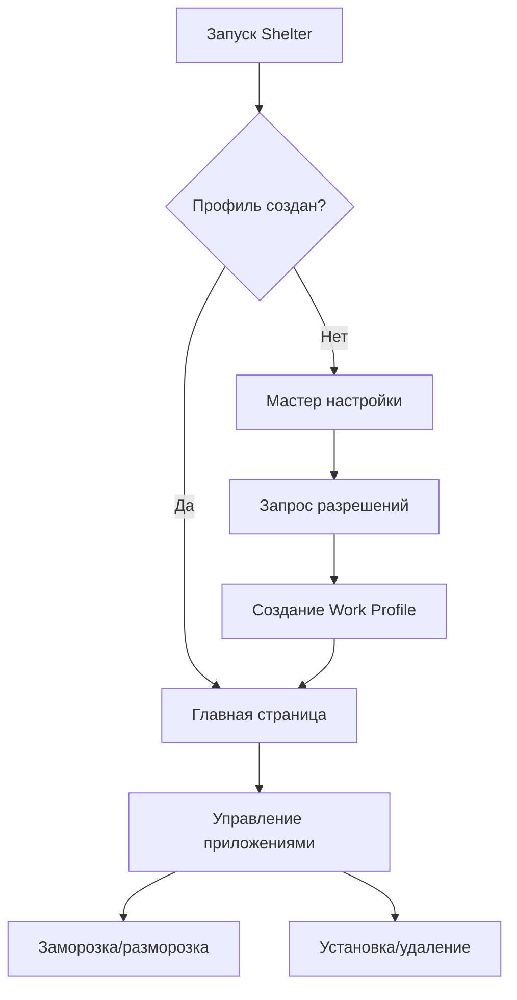

# Требования к адаптации Shelter для Android 16 (API 36) и Pixel 9a

## 1. Обзор проекта

Shelter - это приложение с открытым исходным кодом, которое использует функцию "Work Profile" Android для создания изолированного пространства для установки и клонирования приложений. Проект требует адаптации под Android 16 (API 36) для обеспечения совместимости с Pixel 9a и новыми требованиями платформы.

## 2. Основные функции

### 2.1 Роли пользователей

| Роль | Метод регистрации | Основные разрешения |
|------|-------------------|---------------------|
| Обычный пользователь | Установка приложения | Создание и управление рабочим профилем |
| Администратор устройства | Активация Device Admin | Полный контроль над рабочим профилем |

### 2.2 Модули функций

Приложение состоит из следующих основных страниц:
1. **Главная страница**: список приложений, управление профилем, навигация
2. **Мастер настройки**: пошаговая настройка рабочего профиля
3. **Страница настроек**: конфигурация приложения, управление разрешениями
4. **Активность управления**: установка/удаление приложений, заморозка/разморозка

### 2.3 Детали страниц

| Название страницы | Название модуля | Описание функции |
|-------------------|-----------------|------------------|
| Главная страница | Список приложений | Отображение установленных приложений в рабочем профиле |
| Главная страница | Панель управления | Заморозка/разморозка приложений, клонирование |
| Мастер настройки | Создание профиля | Инициализация рабочего профиля через DevicePolicyManager |
| Мастер настройки | Настройка разрешений | Запрос необходимых разрешений для работы |
| Настройки | Конфигурация | Управление поведением приложения |
| Активность управления | Установка APK | Установка приложений в рабочий профиль |

## 3. Основной процесс

**Поток пользователя:**
1. Пользователь запускает приложение
2. Если рабочий профиль не создан - запускается мастер настройки
3. Пользователь предоставляет необходимые разрешения
4. Создается рабочий профиль через DevicePolicyManager
5. Пользователь может устанавливать и управлять приложениями в изолированном пространстве

## 4. Дизайн пользовательского интерфейса

### 4.1 Стиль дизайна
- **Основные цвета**: Material Design 3 цветовая схема
- **Стиль кнопок**: Material Design кнопки с закругленными углами
- **Шрифт**: Roboto, размеры 14sp-18sp для основного текста
- **Стиль макета**: Адаптивный дизайн с поддержкой edge-to-edge
- **Иконки**: Material Design Icons

### 4.2 Обзор дизайна страниц

| Название страницы | Название модуля | UI элементы |
|-------------------|-----------------|-------------|
| Главная страница | Список приложений | RecyclerView с карточками приложений, FAB для добавления |
| Главная страница | Панель управления | Toolbar с действиями, bottom navigation |
| Мастер настройки | Шаги настройки | ViewPager2 с фрагментами, прогресс-бар |
| Настройки | Список настроек | PreferenceScreen с категориями |

### 4.3 Адаптивность

Приложение должно поддерживать:
- Edge-to-edge дизайн (обязательно для Android 16)
- Адаптивные макеты для больших экранов (>600dp)
- Поддержку альбомной и портретной ориентации
- Совместимость с Pixel 9a (экран 6.3", разрешение 2424×1080)
