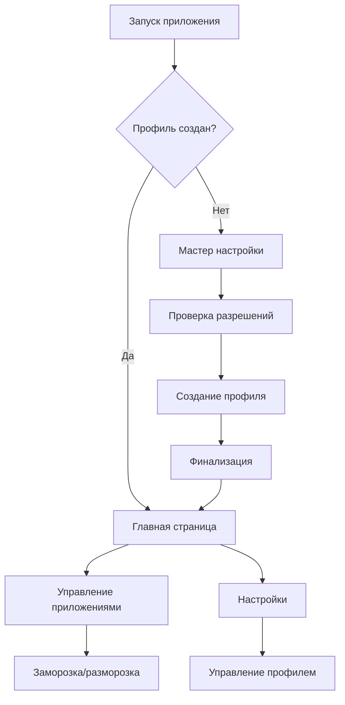

# План реализации адаптации Shelter для Android 16

## 1. Обзор проекта

Shelter - это приложение для создания изолированных рабочих профилей на Android, позволяющее пользователям "замораживать" приложения и изолировать их от основного профиля. Проект требует адаптации для корректной работы на Android 16 (API 36) и устройстве Pixel 9a.

## 2. Основные функции

### 2.1 Роли пользователей

| Роль | Метод регистрации | Основные разрешения |
|------|-------------------|---------------------|
| Администратор устройства | Активация через настройки устройства | Создание рабочих профилей, управление политиками |
| Обычный пользователь | Автоматически после настройки | Использование приложений в рабочем профиле |

### 2.2 Модули функций

Наше приложение состоит из следующих основных страниц:
1. **Главная страница**: список приложений, управление заморозкой, навигация
2. **Мастер настройки**: пошаговая настройка рабочего профиля
3. **Страница настроек**: конфигурация приложения, управление разрешениями
4. **Страница управления**: установка/удаление приложений в рабочем профиле

### 2.3 Детали страниц

| Название страницы | Название модуля | Описание функции |
|-------------------|-----------------|------------------|
| Главная страница | Список приложений | Отображение установленных приложений с возможностью заморозки/разморозки |
| Главная страница | Панель управления | Быстрые действия: заморозить все, разморозить все, настройки |
| Мастер настройки | Проверка разрешений | Проверка и запрос необходимых разрешений администратора устройства |
| Мастер настройки | Создание профиля | Создание изолированного рабочего профиля через DevicePolicyManager |
| Мастер настройки | Финализация | Завершение настройки и переход к основному интерфейсу |
| Настройки | Управление профилем | Удаление профиля, сброс настроек, экспорт/импорт |
| Настройки | Автоматизация | Настройка автоматической заморозки, расписания |
| Управление | Установка приложений | Установка APK файлов в рабочий профиль |
| Управление | Клонирование | Клонирование приложений из основного профиля |

## 3. Основной процесс

**Процесс настройки администратора:**
1. Пользователь запускает приложение впервые
2. Система проверяет наличие разрешений администратора устройства
3. Если разрешений нет - запускается мастер настройки
4. Пользователь предоставляет разрешения через системные настройки
5. Приложение создает рабочий профиль
6. Переход к основному интерфейсу

**Процесс управления приложениями:**
1. Пользователь видит список всех приложений
2. Выбирает приложение для заморозки/разморозки
3. Система выполняет операцию через DevicePolicyManager
4. Обновляется статус приложения в интерфейсе



## 4. Дизайн пользовательского интерфейса

### 4.1 Стиль дизайна

- **Основные цвета**: Material You динамические цвета (для Android 16)
- **Вторичные цвета**: #1976D2 (синий), #F57C00 (оранжевый для предупреждений)
- **Стиль кнопок**: Material Design 3 с закругленными углами
- **Шрифт**: Roboto, размеры 14sp (основной текст), 18sp (заголовки)
- **Стиль макета**: Card-based с верхней навигацией, edge-to-edge дизайн
- **Иконки**: Material Design Icons с поддержкой адаптивных иконок Android 16

### 4.2 Обзор дизайна страниц

| Название страницы | Название модуля | UI элементы |
|-------------------|-----------------|-------------|
| Главная страница | Список приложений | RecyclerView с CardView элементами, FloatingActionButton для быстрых действий, адаптивные отступы для edge-to-edge |
| Главная страница | Панель управления | BottomAppBar с иконками действий, поддержка жестов навигации |
| Мастер настройки | Пошаговая навигация | ViewPager2 с индикатором прогресса, Material Design кнопки |
| Настройки | Список настроек | PreferenceScreen с Material Design 3 стилизацией |

### 4.3 Адаптивность

Приложение оптимизировано для мобильных устройств с поддержкой планшетов. Реализована поддержка edge-to-edge UI для Android 16, оптимизация для сенсорного взаимодействия и жестовой навигации.

## 5. Конкретные шаги реализации

### 5.1 Обновление конфигурации проекта

**Файл: app/build.gradle**
```gradle
android {
    compileSdk 36
    buildToolsVersion "36.0.0"
    
    defaultConfig {
        minSdk 24
        targetSdk 36
        // Остальные настройки
    }
    
    compileOptions {
        sourceCompatibility JavaVersion.VERSION_17
        targetCompatibility JavaVersion.VERSION_17
    }
}

dependencies {
    implementation 'androidx.core:core:1.15.0'
    implementation 'androidx.activity:activity:1.9.0'
    implementation 'com.google.android.material:material:1.12.0'
    // Обновленные зависимости для Android 16
}
```

### 5.2 Адаптация AndroidManifest.xml

**Изменения в app/src/main/AndroidManifest.xml:**
```xml
<!-- Удалить устаревшие разрешения -->
<!-- <uses-permission android:name="android.permission.BODY_SENSORS" /> -->

<!-- Добавить новые разрешения для Android 16 -->
<uses-permission android:name="android.permission.health.READ_HEART_RATE" 
    android:minSdkVersion="36" />
<uses-permission android:name="android.permission.BODY_SENSORS" 
    android:maxSdkVersion="35" />

<!-- Обновить активности для поддержки edge-to-edge -->
<activity
    android:name=".ui.MainActivity"
    android:exported="true"
    android:theme="@style/Theme.Shelter.EdgeToEdge">
    <!-- intent-filters -->
</activity>
```

### 5.3 Создание новых тем для Android 16

**Файл: app/src/main/res/values/themes.xml**
```xml
<style name="Theme.Shelter.EdgeToEdge" parent="Theme.Material3.DayNight">
    <item name="android:windowOptOutEdgeToEdgeEnforcement">false</item>
    <item name="android:statusBarColor">@android:color/transparent</item>
    <item name="android:navigationBarColor">@android:color/transparent</item>
    <item name="android:windowLightStatusBar">true</item>
</style>
```

### 5.4 Обновление MainActivity

**Файл: app/src/main/java/net/typeblog/shelter/ui/MainActivity.java**
```java
// Добавить импорты
import androidx.core.view.WindowCompat;
import androidx.core.view.WindowInsetsCompat;
import androidx.core.view.ViewCompat;
import android.window.OnBackInvokedCallback;
import android.window.OnBackInvokedDispatcher;

public class MainActivity extends AppCompatActivity {
    private OnBackInvokedCallback onBackInvokedCallback;
    
    @Override
    protected void onCreate(Bundle savedInstanceState) {
        super.onCreate(savedInstanceState);
        
        // Включить edge-to-edge
        WindowCompat.setDecorFitsSystemWindows(getWindow(), false);
        
        setContentView(R.layout.activity_main);
        
        // Настроить отступы для системных панелей
        View mainView = findViewById(R.id.main_container);
        ViewCompat.setOnApplyWindowInsetsListener(mainView, (v, insets) -> {
            Insets systemBars = insets.getInsets(WindowInsetsCompat.Type.systemBars());
            v.setPadding(systemBars.left, systemBars.top, systemBars.right, systemBars.bottom);
            return insets;
        });
        
        // Настроить predictive back navigation
        setupPredictiveBack();
    }
    
    private void setupPredictiveBack() {
        if (Build.VERSION.SDK_INT >= Build.VERSION_CODES.TIRAMISU) {
            onBackInvokedCallback = () -> {
                // Логика обработки назад
                handleBackNavigation();
            };
            
            getOnBackInvokedDispatcher().registerOnBackInvokedCallback(
                OnBackInvokedDispatcher.PRIORITY_DEFAULT,
                onBackInvokedCallback
            );
        }
    }
    
    private void handleBackNavigation() {
        // Реализация логики навигации назад
        if (getSupportFragmentManager().getBackStackEntryCount() > 0) {
            getSupportFragmentManager().popBackStack();
        } else {
            finish();
        }
    }
    
    @Override
    protected void onDestroy() {
        super.onDestroy();
        if (onBackInvokedCallback != null && Build.VERSION.SDK_INT >= Build.VERSION_CODES.TIRAMISU) {
            getOnBackInvokedDispatcher().unregisterOnBackInvokedCallback(onBackInvokedCallback);
        }
    }
}
```

### 5.5 Создание адаптивных макетов

**Файл: app/src/main/res/layout-sw600dp/activity_main.xml**
```xml
<?xml version="1.0" encoding="utf-8"?>
<androidx.constraintlayout.widget.ConstraintLayout
    xmlns:android="http://schemas.android.com/apk/res/android"
    xmlns:app="http://schemas.android.com/apk/res-auto"
    android:id="@+id/main_container"
    android:layout_width="match_parent"
    android:layout_height="match_parent">
    
    <!-- Навигационная панель для планшетов -->
    <com.google.android.material.navigationrail.NavigationRailView
        android:id="@+id/navigation_rail"
        android:layout_width="wrap_content"
        android:layout_height="0dp"
        app:layout_constraintStart_toStartOf="parent"
        app:layout_constraintTop_toTopOf="parent"
        app:layout_constraintBottom_toBottomOf="parent" />
    
    <!-- Основной контент -->
    <FrameLayout
        android:id="@+id/fragment_container"
        android:layout_width="0dp"
        android:layout_height="0dp"
        app:layout_constraintStart_toEndOf="@id/navigation_rail"
        app:layout_constraintEnd_toEndOf="parent"
        app:layout_constraintTop_toTopOf="parent"
        app:layout_constraintBottom_toBottomOf="parent" />
        
</androidx.constraintlayout.widget.ConstraintLayout>
```

### 5.6 Обновление ShelterService для JobScheduler

**Файл: app/src/main/java/net/typeblog/shelter/services/ShelterService.java**
```java
@Override
public boolean onStopJob(JobParameters params) {
    int stopReason = params.getStopReason();
    
    switch (stopReason) {
        case JobParameters.STOP_REASON_TIMEOUT_ABANDONED:
            Log.w(TAG, "Job abandoned due to timeout - cleaning up resources");
            cleanupResources();
            break;
        case JobParameters.STOP_REASON_QUOTA:
            Log.w(TAG, "Job stopped due to quota limitations");
            break;
        default:
            Log.i(TAG, "Job stopped with reason: " + stopReason);
    }
    
    // Не перепланировать автоматически для избежания проблем с квотами
    return false;
}

private void cleanupResources() {
    // Очистка ресурсов при принудительной остановке
    // Сохранение состояния, закрытие соединений и т.д.
}
```

## 6. План тестирования

### 6.1 Этапы тестирования

1. **Модульное тестирование**: Проверка отдельных компонентов
2. **Интеграционное тестирование**: Тестирование взаимодействия с Android API
3. **UI тестирование**: Проверка интерфейса на различных размерах экранов
4. **Тестирование на устройстве**: Специфичные тесты для Pixel 9a

### 6.2 Критерии приемки

- ✅ Приложение запускается на Android 16
- ✅ Корректно работает edge-to-edge UI
- ✅ Predictive back navigation функционирует
- ✅ Создание рабочего профиля работает
- ✅ Заморозка/разморозка приложений функционирует
- ✅ Адаптивный дизайн для больших экранов
- ✅ Совместимость с жестовой навигацией

## 7. Временные рамки

| Этап | Продолжительность | Описание |
|------|-------------------|----------|
| Подготовка | 2 дня | Обновление зависимостей, анализ изменений |
| Основная разработка | 5 дней | Реализация всех изменений для Android 16 |
| Тестирование | 3 дня | Комплексное тестирование на различных устройствах |
| Отладка и оптимизация | 2 дня | Исправление найденных проблем |
| Финальная проверка | 1 день | Последняя проверка перед релизом |

**Общее время: 13 дней**

## 8. Риски и митигация

| Риск | Вероятность | Влияние | Митигация |
|------|-------------|---------|----------|
| Несовместимость DevicePolicyManager API | Средняя | Высокое | Тестирование на ранней стадии, поиск альтернативных API |
| Проблемы с edge-to-edge на разных устройствах | Высокая | Среднее | Тестирование на множестве устройств, fallback решения |
| Изменения в Work Profile API | Низкая | Высокое | Мониторинг документации Android, подготовка планов Б |

## 9. Послерелизная поддержка

- Мониторинг отзывов пользователей
- Быстрое реагирование на критические ошибки
- Планирование следующих обновлений для новых версий Android
- Обновление документации и руководств пользователя