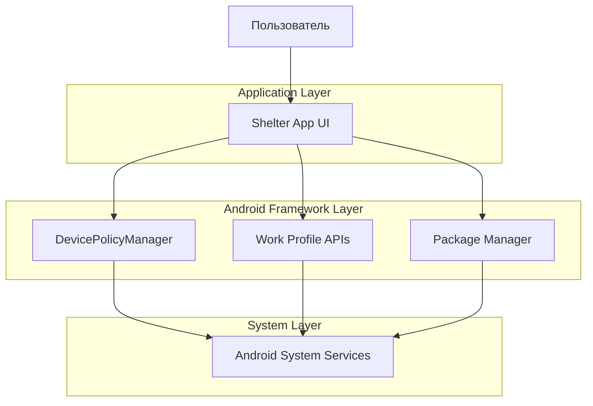
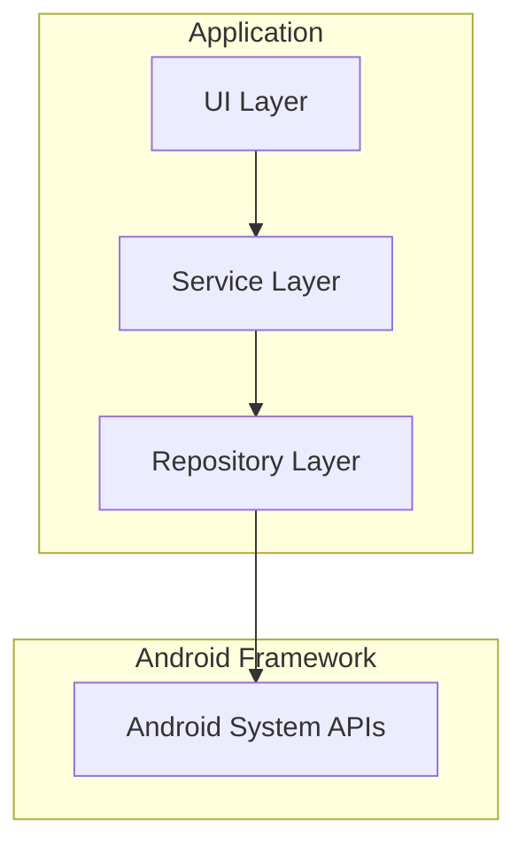
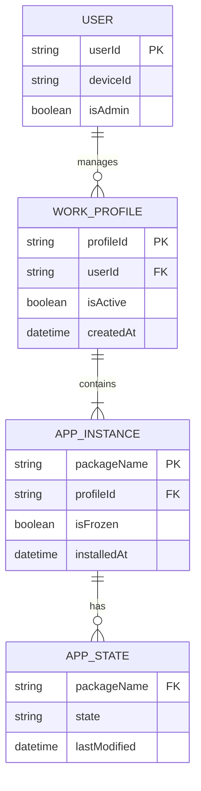

# Техническая архитектура адаптации Shelter для Android 16

## 1. Архитектурный дизайн



## 2. Описание технологий

- **Frontend**: Android Native (Java/Kotlin) + Material Design 3
- **Backend**: Android System APIs (DevicePolicyManager, PackageManager)
- **Database**: SharedPreferences для настроек
- **Архитектура**: MVVM с Android Architecture Components

## 3. Определения маршрутов

| Маршрут | Назначение |
|---------|------------|
| MainActivity | Главная активность с навигацией и списком приложений |
| SetupWizardActivity | Мастер настройки рабочего профиля |
| SettingsActivity | Экран настроек приложения |
| DummyActivity | Прокси-активность для межпрофильных интентов |
| FinalizeActivity | Завершение настройки профиля |

## 4. Критические изменения для Android 16 (API 36)

### 4.1 Обновление целевого SDK

**Текущая конфигурация:**
```gradle
compileSdk 35
targetSdkVersion 35
minSdkVersion 24
```

**Требуемые изменения:**
```gradle
compileSdk 36
targetSdkVersion 36
minSdkVersion 24
buildToolsVersion = '36.0.0'
```

### 4.2 Edge-to-Edge UI (Обязательно)

**Проблема:** Android 16 принудительно включает edge-to-edge для всех приложений, нацеленных на API 36.

**Решение:**
```xml
<!-- Удалить из themes.xml -->
<item name="android:windowOptOutEdgeToEdgeEnforcement">true</item>
```

**Код адаптации:**
```kotlin
// В MainActivity.onCreate()
WindowCompat.setDecorFitsSystemWindows(window, false)
ViewCompat.setOnApplyWindowInsetsListener(findViewById(R.id.main)) { v, insets ->
    val systemBars = insets.getInsets(WindowInsetsCompat.Type.systemBars())
    v.setPadding(systemBars.left, systemBars.top, systemBars.right, systemBars.bottom)
    insets
}
```

### 4.3 Predictive Back Navigation

**Проблема:** onBackPressed() больше не вызывается в Android 16.

**Решение:**
```kotlin
// Заменить onBackPressed() на OnBackInvokedCallback
class MainActivity : AppCompatActivity() {
    private val onBackInvokedCallback = OnBackInvokedCallback {
        // Логика обработки назад
        handleBackNavigation()
    }
    
    override fun onCreate(savedInstanceState: Bundle?) {
        super.onCreate(savedInstanceState)
        onBackInvokedDispatcher.registerOnBackInvokedCallback(
            OnBackInvokedDispatcher.PRIORITY_DEFAULT,
            onBackInvokedCallback
        )
    }
}
```

### 4.4 Адаптивные макеты для больших экранов

**Проблема:** Android 16 игнорирует ограничения ориентации на экранах >600dp.

**Решение:**
```xml
<!-- res/layout-sw600dp/activity_main.xml -->
<androidx.constraintlayout.widget.ConstraintLayout
    android:layout_width="match_parent"
    android:layout_height="match_parent"
    android:orientation="horizontal">
    
    <!-- Адаптивный макет для планшетов -->
    <fragment
        android:id="@+id/navigation_fragment"
        android:layout_width="0dp"
        android:layout_height="match_parent"
        android:layout_weight="1" />
        
    <fragment
        android:id="@+id/content_fragment"
        android:layout_width="0dp"
        android:layout_height="match_parent"
        android:layout_weight="2" />
        
</androidx.constraintlayout.widget.ConstraintLayout>
```

### 4.5 Обновления разрешений

**Проблема:** BODY_SENSORS разрешения изменились в Android 16.

**Текущий AndroidManifest.xml:**
```xml
<uses-permission android:name="android.permission.BODY_SENSORS" />
```

**Обновленный AndroidManifest.xml:**
```xml
<!-- Для Android 16+ -->
<uses-permission android:name="android.permission.health.READ_HEART_RATE" />
<uses-permission android:name="android.permission.health.READ_STEPS" />
<!-- Сохранить для совместимости с более старыми версиями -->
<uses-permission android:name="android.permission.BODY_SENSORS" android:maxSdkVersion="35" />
```

### 4.6 JobScheduler оптимизации

**Проблема:** Изменения в квотах выполнения задач.

**Решение:**
```kotlin
// В ShelterService
override fun onStopJob(params: JobParameters): Boolean {
    val stopReason = params.stopReason
    when (stopReason) {
        JobParameters.STOP_REASON_TIMEOUT_ABANDONED -> {
            Log.w(TAG, "Job abandoned - cleaning up resources")
            // Очистка ресурсов
        }
        // Другие причины остановки
    }
    return false // Не перепланировать автоматически
}
```

## 5. Архитектура сервера



## 6. Модель данных

### 6.1 Определение модели данных



### 6.2 Язык определения данных

**SharedPreferences структура:**
```kotlin
// Настройки профиля
class ProfilePreferences {
    companion object {
        const val PREF_PROFILE_CREATED = "profile_created"
        const val PREF_PROFILE_ID = "profile_id"
        const val PREF_AUTO_FREEZE = "auto_freeze_enabled"
        const val PREF_CROSS_PROFILE_INTENT = "cross_profile_intent_enabled"
    }
}

// Состояние приложений
class AppStateManager {
    fun saveAppState(packageName: String, isFrozen: Boolean) {
        val prefs = context.getSharedPreferences("app_states", Context.MODE_PRIVATE)
        prefs.edit()
            .putBoolean("${packageName}_frozen", isFrozen)
            .putLong("${packageName}_timestamp", System.currentTimeMillis())
            .apply()
    }
}
```

## 7. План миграции

### 7.1 Этап 1: Подготовка (Неделя 1)
- Обновление Gradle и зависимостей
- Тестирование на Android 16 Beta
- Анализ совместимости API

### 7.2 Этап 2: Основные изменения (Неделя 2-3)
- Реализация edge-to-edge UI
- Миграция на predictive back
- Адаптация макетов для больших экранов

### 7.3 Этап 3: Тестирование (Неделя 4)
- Тестирование на Pixel 9a
- Проверка совместимости с различными размерами экранов
- Оптимизация производительности

### 7.4 Этап 4: Развертывание (Неделя 5)
- Подготовка релиза
- Обновление документации
- Публикация в F-Droid

## 8. Требования к тестированию

### 8.1 Целевые устройства
- Pixel 9a (основная цель)
- Pixel Tablet (тестирование больших экранов)
- Различные Android 16 эмуляторы

### 8.2 Ключевые сценарии тестирования
1. Создание рабочего профиля на чистом устройстве
2. Установка и заморозка приложений
3. Поворот экрана и изменение размера окна
4. Навигация назад во всех активностях
5. Edge-to-edge отображение на различных экранах